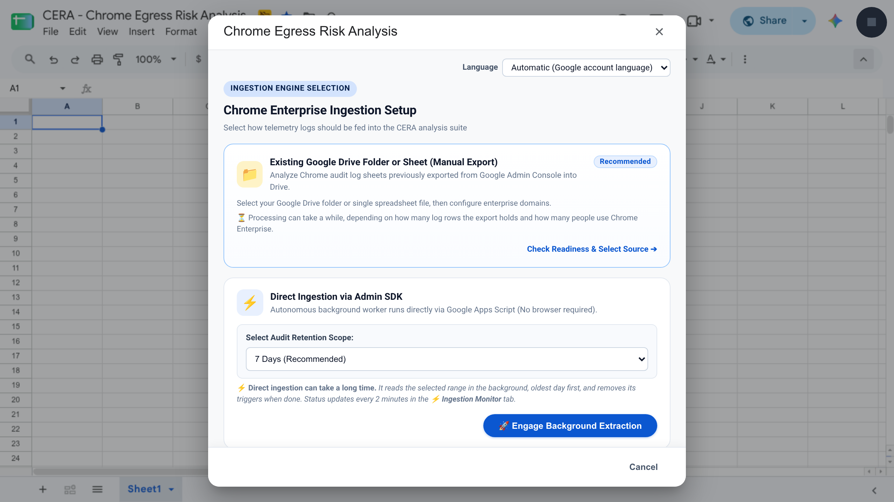
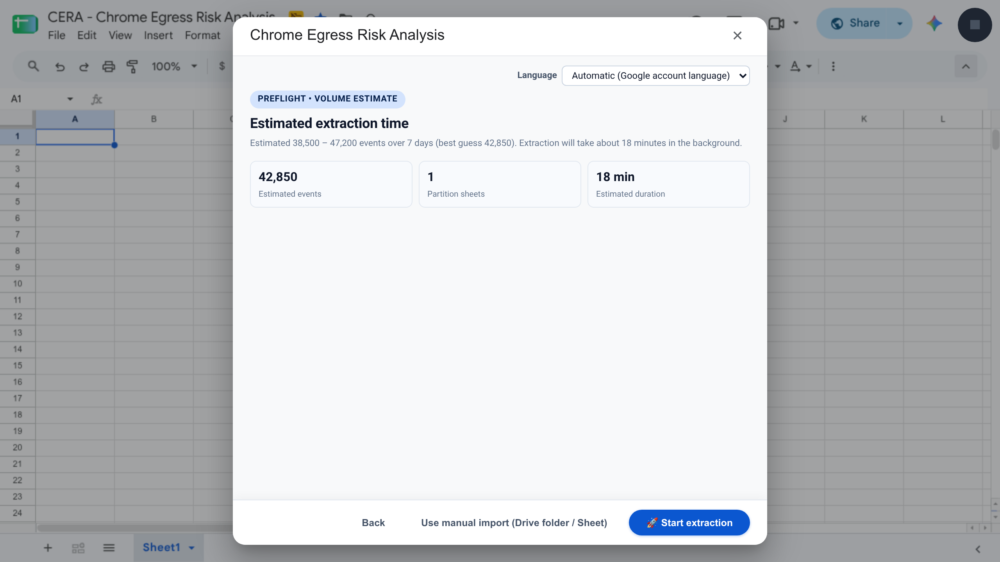
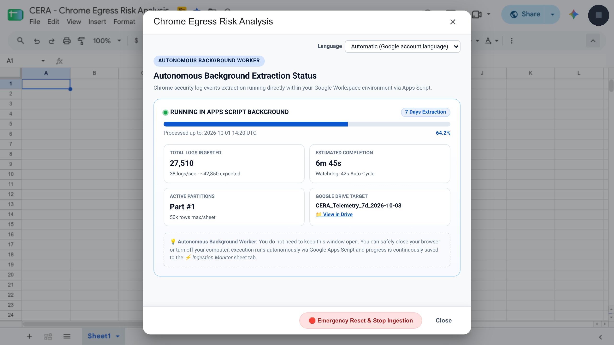
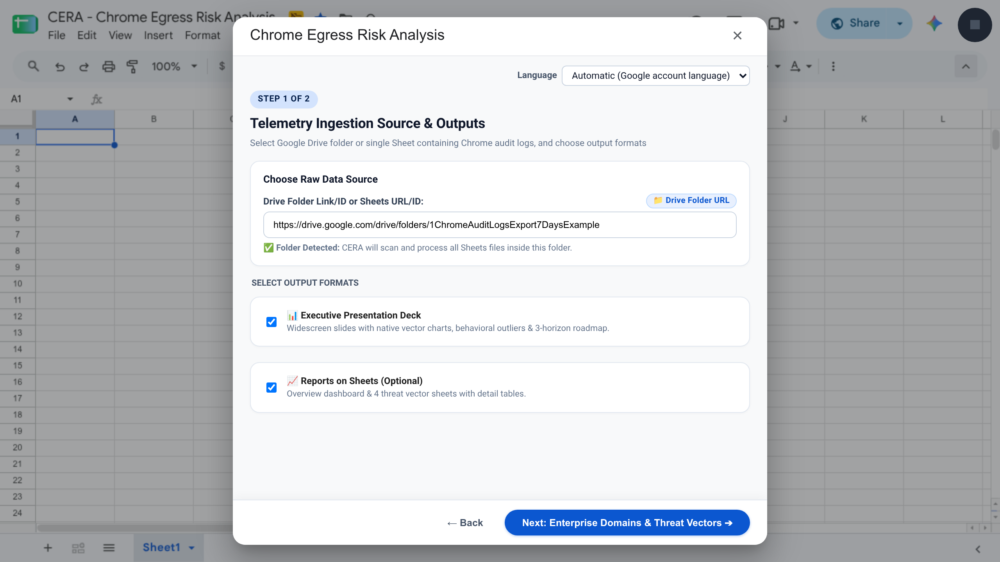
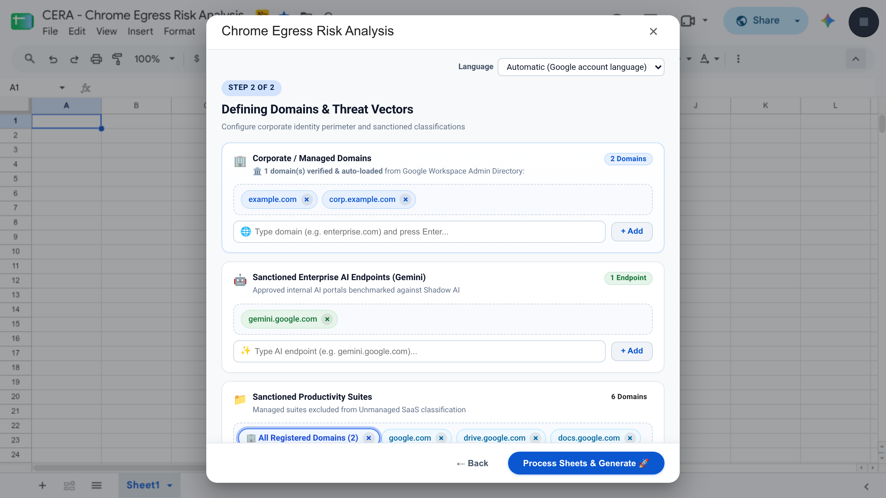
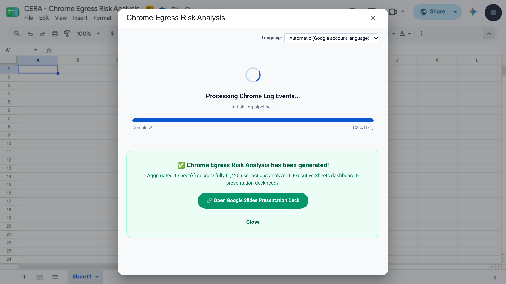

# 🛡️ CERA — Chrome Egress Risk Analysis

> **Disclaimer:** This is not an officially supported Google product. CERA is an open-source reference utility provided by the authors and contributors on an **"AS IS"** basis under the [Apache License 2.0](../../LICENSE), without warranties, Service Level Agreements (SLAs), or technical support commitments of any kind. Before deploying or running CERA, review the full [**Disclaimer, Terms of Use & Tenant Privacy Policy (`./DISCLAIMER.md`)**](./DISCLAIMER.md).

**CERA (Chrome Egress Risk Analysis)** is a self-hosted Google Apps Script add-on, bound to a Google Sheets spreadsheet, that reads Chrome Enterprise security log events and automatically generates:
- an **executive Google Slides briefing deck** (16:9 widescreen presentation with native vector charts, behavioral outlier analytics, and a 3-horizon remediation roadmap); and
- a **multi-tab Google Sheets analytical workbook** (Executive Overview, Policy Outcomes matrix, 4 outbound channel tabs, and Security Signals Radar).

They show how data leaves the organization through the browser, which organizational units and destinations drive that volume, and what your Chrome policies did about it—executing **100% inside your own Google Workspace tenant** with zero external network calls or telemetry.

---

## ✨ Key Capabilities

* **Counts User Actions, Not Raw Log Rows:** Chrome writes multiple log rows for a single file upload, clipboard paste, download, or print job (for example, a content transfer row plus one or more sensitive-data detector rows). CERA assembles related log rows within a 10-second window into **one user action** before counting, so executive figures are never artificially inflated.
* **Four Outbound Data Channels + Security Signals Radar:**
  1. **Personal Accounts** — uploads and pastes while signed into consumer webmail or personal cloud storage accounts.
  2. **Shadow AI** — unsanctioned generative AI tools benchmarked against your sanctioned enterprise AI endpoints.
  3. **Unmanaged Apps** — file converters, unapproved SaaS, and external file-sharing hosts.
  4. **Web Messaging** — browser chat and collaboration platforms.
  * *Counted separately:* **Physical & PDF Printing** (`PAGE_PRINT` gets its own dedicated slide and Policy Outcomes breakdown, never mixed into web channels) and **Security Signals Radar** (Safe Browsing warnings and bypass rates, corporate password reuse, flagged downloads, and browser launches with command-line switches).
* **Policy Outcome Modes (CEC & CEP):** Automatically classifies the tenant's data-protection posture from log outcomes into **Enforced** mode (Chrome Enterprise Premium blocking, warning, user cancellation, or masking), **Audit-only** mode (Chrome Enterprise Core listening/detection mode), or **Not Reported**.
* **7-Day Sample Window with Built-In Policy Pre-Check:**
  * Both **Manual Export** and **Direct Ingestion via Admin SDK** operate on a focused **7-day sample (`7 Days`)** to produce directional executive insights reliably within Google Apps Script quotas.
  * **Automated Chrome Policy Pre-Check (Step 0):** When an administrator opens CERA, it automatically checks the Chrome Policy API to verify whether **Managed Browser Cloud Reporting**, **Security Event Reporting** (across all 7 event types), and the **Chrome Enterprise Reporting Connector** are enabled on the tenant. Non-admin users are guided seamlessly to the Manual Export workflow.
  * **Stop & Analyze Partial Extractions Anytime:** During Direct Ingestion via the Admin SDK, administrators can click **Stop & Analyze Extracted Logs Now** at any point to stop the background worker and immediately generate the executive deck and workbook from the partitions already extracted to Google Drive.
* **Five Languages Across UI, Reports & Admin Console Exports:**
  * Full localization in **English (`en`)**, **Japanese (`ja`)**, **Korean (`ko`)**, **Simplified Chinese (`zh-CN`)**, and **Indonesian (`id`)** across the setup dialog, `⚡ Ingestion Monitor` tab, workbook, and slide deck.
  * **Multi-Locale Manual Export Normalization:** Automatically normalizes Google Admin console manual export column headers and categorical event values exported in any of the 5 supported languages (`en`, `ja`, `ko`, `zh-CN`, `id`), with an explicit guard if required columns are missing or in an unsupported language.

---

## 🖼️ Application Workflow & UI Highlights

| 1. Step 0 — Ingestion Setup & Policy Pre-Check | 2. Pre-Flight Volume & Duration Estimator |
| :---: | :---: |
|  |  |
| *Select your report language (`en`, `id`, `ja`, `ko`, `zh-CN`), verify Chrome reporting policy readiness, and choose between Manual Export (7 Days) or Direct Ingestion via Admin SDK (7 Days).* | *Before starting Direct Ingestion, CERA samples your 7-day Chrome log volume and estimates event counts, Drive partitions, and background extraction time.* |

| 3. Autonomous Background Extraction Monitor | 4. Step 1 — Telemetry Source & Output Formats |
| :---: | :---: |
|  |  |
| *Runs autonomously via 1-minute Apps Script triggers (safe to close your browser), or click **Stop & Analyze Extracted Logs Now** to analyze partial logs immediately.* | *Point CERA to a single exported Google Sheet or a Google Drive folder of partitions, and select your deliverables (Executive Slide Deck and/or Sheets Workbook).* |

| 5. Step 2 — Corporate Domains & Threat Vectors | 6. Analysis Complete & Deliverable Links |
| :---: | :---: |
|  |  |
| *Auto-loads verified corporate domains from Google Workspace Directory and lets you customize Sanctioned Enterprise AI, Productivity Suites, Web Messaging, and Partner domains.* | *Displays the total sheets and assembled user actions analyzed, with a direct link to open the generated Google Slides Executive Briefing Deck.* |

---

## 📋 Prerequisites

1. **Chrome Enterprise Telemetry:** Managed Chrome browsers (Chrome Enterprise Core or Chrome Enterprise Premium) with **Managed browser reporting**, **Event reporting** (`Content transfer`, `Sensitive data transfer`, `Malware transfer`, `Content unscanned`, `Password reuse`, `Unsafe site visit`, `Suspicious browser launch`), and the **Chrome Enterprise reporting connector** enabled in the Google Admin console (`Devices › Chrome › Settings › Users & browsers`).
2. **Permissions:**
   * **Manual Export path (Recommended):** Standard Google Drive and Google Sheets access to the exported 7-day log sheet(s). No Admin Console API role is required to run the analysis on exported sheets. *(Manual exports generated in English, Japanese, Korean, Simplified Chinese, or Indonesian are normalized automatically; if your account uses another language, switch to English at [`myaccount.google.com/language`](https://myaccount.google.com/language) before exporting).*
   * **Direct Ingestion & Policy Pre-Check path:** A Google Workspace administrator account with **Reports** (`admin.reports.audit.readonly`), **Domain / Org Unit Read** (`admin.directory.domain.readonly`, `admin.directory.orgunit.readonly`), and **Chrome Policy Read** (`chrome.management.policy.readonly`) privileges.
3. **Node.js & `clasp` (for command-line deployment):** Install Google's official Apps Script CLI:
   ```bash
   npm install -g @google/clasp
   clasp login
   ```

---

## 🚀 Step-by-Step Deployment Guide (`clasp push`)

CERA is a **container-bound Google Sheets script**. All source files live directly in this directory (`AppsScript-examples/cera/`).

### Step 1: Create a Host Google Sheet & Copy Its Script ID
1. Open [sheets.new](https://sheets.new) in your Google Workspace account to create a new blank spreadsheet, and name it **`CERA — Chrome Egress Risk Analysis`**.
2. In the top menu bar, click **Extensions ➔ Apps Script**.
3. In the Apps Script editor, click the **Gear Icon (⚙️ Project Settings)** on the left sidebar.
4. Scroll down to **IDs** and copy the **Script ID**.

### Step 2: Push the CERA Files to Your Google Sheet
1. Clone this repository and navigate to `AppsScript-examples`:
   ```bash
   git clone https://github.com/google/ChromeBrowserEnterprise.git
   cd ChromeBrowserEnterprise/AppsScript-examples
   ```
2. Create a local `.clasp.json` file in `AppsScript-examples/` pointing `rootDir` to `"cera"` and pasting your **Script ID**:
   ```json
   {
     "scriptId": "PASTE_YOUR_SCRIPT_ID_HERE",
     "rootDir": "cera"
   }
   ```
3. Push all CERA `.gs` modules, `UiDialog.html`, and `appsscript.json` into your Google Sheet:
   ```bash
   clasp push -f
   ```
   *(Note: CERA runs on the default Google Cloud project automatically created by Google Sheets for your bound Apps Script container—no manual GCP project setup is required.)*

### Step 3: Open CERA in Google Sheets
1. Reload your Google Sheet (`F5` / `⌘R`) and wait 3–5 seconds for the custom menu to initialize.
2. Click **`🛡️ CERA` ➔ `Chrome Egress Risk Analysis`** in the top menu bar (to the right of *Help*).
3. Approve the one-time OAuth authorization prompt for your self-owned spreadsheet script copy, then launch **`🛡️ CERA` ➔ `Chrome Egress Risk Analysis`** to open the setup wizard.

---

## 📂 Files in This Directory (`AppsScript-examples/cera/`)

| File | Responsibility |
|---|---|
| `appsscript.json` | Apps Script V8 manifest declaring enabled Advanced Services (`AdminDirectory`, `AdminReports`, `Sheets`, `Drive`) and minimal OAuth scopes |
| `Config.gs` | `CeraConfig`: version, thresholds, action assembly windows, vector gates, switch classifications, default domain registries, and MD3 palette |
| `Utils.gs` | Formatting, dates, domain matching, MIME and URL category labels, and locale-aware list joining |
| `I18n.gs`, `I18nMessages.gs` | Runtime translation (`ceraT`, plurals, number formats) and pre-compiled 5-locale (`en`, `id`, `ja`, `ko`, `zh-CN`) message catalog |
| `ConsoleLabels.gs` | Pre-compiled 5-locale (`en`, `id`, `ja`, `ko`, `zh-CN`) Google Admin console manual-export column header and categorical value normalization tables |
| `UiController.gs`, `UiDialog.html` | Custom `🛡️ CERA` menu, Chrome Policy Pre-Check (`checkChromePolicies`), setup dialog UI, and server-side handlers |
| `PreflightEstimator.gs` | Pre-flight Reports API access check, 7-day log volume sampling probes, partition plan, and duration estimator |
| `AdminSdkIngestion.gs` | Direct Ingestion worker: 7 Chrome event streams, pagination, 50,000-row Drive partitions, checkpointing, rate-limit backoff, and partial-run stop/analyze |
| `IngestionMonitorSheet.gs` | Renders and updates the live **⚡ Ingestion Monitor** sheet tab in the selected CERA language |
| `IngestionPipeline.gs` | Core analysis pipeline (`executeDlpAnalysis`), multi-batch continuation, column resolution, row normalization, and vector aggregation |
| `ActionAssembler.gs` | Folds multiple raw Chrome log rows belonging to one user action into a single action and resolves its policy outcome |
| `BrowserLaunches.gs` | Deduplicates `SUSPICIOUS_BROWSER_LAUNCH` events per device launch and classifies command-line switches |
| `DataAggregators.gs` | Analysis state structures, policy outcome mode resolution (`enforced`, `audit`, `not_reported`), and vector accumulators |
| `OutlierAnalytics.gs` | Daily velocity peaks ($3\sigma$), user concentration (top 80% share), destination funneling (HHI), and per-vector timelines |
| `InsightEngine.gs`, `DynamicNarrativeEngine.gs` | Data-driven slide headlines, vector visibility gates, recommendations, and localized narrative builders |
| `SheetsReportEngine.gs`, `SheetsChartEngine.gs` | Multi-tab Google Sheets analytical workbook and native Sheets charts |
| `SlidesPresentationEngine.gs`, `VectorChartEngine.gs` | 16:9 widescreen Google Slides executive deck and native vector shape charts |
| `EventDiscovery.gs` | Diagnostic utility to inspect Chrome event names and parameter keys present in a tenant's logs |
| `DISCLAIMER.md` | Official Disclaimer, Terms of Use, Quota Notice & Tenant Privacy Policy |

---

## 🔒 Privacy, Quotas & Legal Disclaimer

* **100% In-Tenant Execution & Zero Telemetry:** All log ingestion, action assembly, threat classification, spreadsheet generation, and slide deck rendering run exclusively inside your organization's Google Workspace environment. CERA makes no external network requests and collects zero telemetry.
* **Informational Sample & Workspace Quotas:** CERA analyzes a 7-day sample of available Chrome logs for directional executive insights (it is not a formal compliance certification or continuous SIEM) and consumes the authorizing user's Google Apps Script runtime, Google Drive storage, and Admin SDK API quotas.
* **Full Disclaimer & Privacy Policy:** See [**`./DISCLAIMER.md`**](./DISCLAIMER.md) (`https://github.com/google/ChromeBrowserEnterprise/blob/main/AppsScript-examples/cera/DISCLAIMER.md`).
