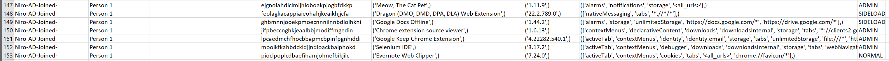
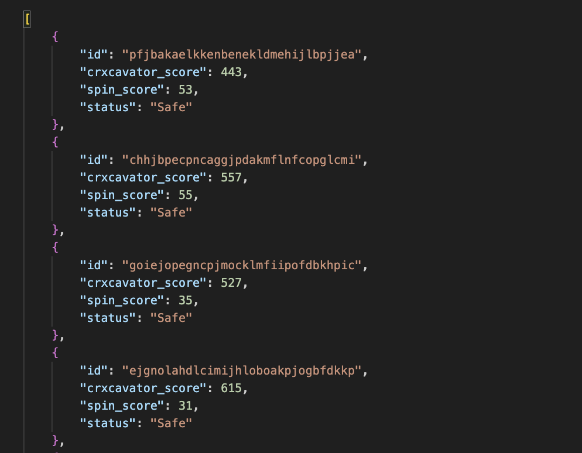

## Get extension list using Takeout API
Using the [script](extension_query.py) (
[python 2.7 compatible version](extension_query_py2.py)) to download extensions
list from all browsers.

### Setup Access to API

Before using CBCM Takeout API you will need to do some initial setup:

1.  Enable the Admin SDK API (if not already enabled) in the Google Developer
    Console by following this
    [link](https://console.developers.google.com/apis/api/admin.googleapis.com/overview?project=_)
    and selecting the project on which you wish to enable the API.
1.  Create a service account and have the necessary service account keys for
    this service account. You can follow
    [this](https://developers.google.com/admin-sdk/directory/v1/guides/delegation)
    for creating a service account and getting the service account keys. You
    must grant the service account the "Service Account User" role on the
    permissions during creation.
1.  The client ID for this service account will need to be authorized for the
    OAuth scopes listed below in the Admin Console under Security -> Advanced
    settings -> Manage API client access. On this page, the Client ID
    corresponds to the Unique ID of your service account. You will need to
    authorize the client ID for the scope:
    * https://www.googleapis.com/auth/admin.directory.device.chromebrowsers.readonly

### Running the Script


With the service account keys, you can now run the script which uses Google API
Client Libraries to make the necessary queries to the API. The script requires
that both the service account keys you downloaded from the developers console as
well as the e-mail of an admin user in your domain that is allowed to access the
data you wish to query.

You can run the script from the command-line:
```
python extension_query.py --service_account_key_path <service_account_key_file> --admin_email <admin_email>
```
(also: `python extension_query.py --help` for a reminder of the
argument names)

## Example Data output

Here is an example of what that data will look like:


## Move Chrome browsers between Organization Units
You can use the [moveBrowserToOrgUnit](moveBrowserToOrgUnit.py) to move enrolled browser between Organization Units (OU). 

Note: You will need to add the customer ID, the service account key JSON file, and the destination OU path to the script.

👉 Add the customer id [here](https://github.com/google/ChromeBrowserEnterprise/blob/main/Python/moveBrowserToOrgUnit.py#L12). You can find the customer Id by navigating to the Google Admin Console > Account > Account Settings.

👉 Add the path to the OAuth client secret file [here](https://github.com/google/ChromeBrowserEnterprise/blob/main/Python/moveBrowserToOrgUnit.py#L10). You can download the file from the Google Developer Console

👉 Add the [destination OU path](https://github.com/google/ChromeBrowserEnterprise/blob/main/Python/moveBrowserToOrgUnit.py#L14). An example of the destination OU path 'North America/Austin/AUS Managed User'

```
python moveBrowserToOrgUnit.py
```

## Get Chrome Signed-On User account names
You can use the [cbcm-profiles-export.py](cbcm-profiles-export.py) to get a CSV export of Signed-On User account names. 

Note: You will need to add the customer ID, the service account key JSON file, and the destination OU path to the script.

👉 Add the customer id [here](https://github.com/google/ChromeBrowserEnterprise/blob/main/Python/cbcm-profiles-export.py#L24). You can find the customer Id by navigating to the Google Admin Console > Account > Account Settings.

👉 Add the path to the OAuth client secret file [here](https://github.com/google/ChromeBrowserEnterprise/blob/main/Python/cbcm-profiles-export.py#L22). You can download the file from the Google Developer Console

👉 Optional: Add the [destination OU path](https://github.com/google/ChromeBrowserEnterprise/blob/main/Python/cbcm-profiles-export.py#L26). An example of the destination OU path 'North America/Austin/AUS Managed User'

```
python cbcm-profiles-export.py
```

## Get extension list with Chrome Profile 
You can use the [cbcm-browser-extension-profile-export.py](cbcm-browser-extension-profile-export.py) to get a CSV export of all extensions from managed browser including Profile and Signed-On User account names. 

Note: You will need to add the customer ID, the service account key JSON file, and the destination OU path to the script.

👉 Add the customer id [here](https://github.com/google/ChromeBrowserEnterprise/blob/main/Python/cbcm-profiles-export.py#L24). You can find the customer Id by navigating to the Google Admin Console > Account > Account Settings.

👉 Add the path to the OAuth client secret file [here](https://github.com/google/ChromeBrowserEnterprise/blob/main/Python/cbcm-profiles-export.py#L22). You can download the file from the Google Developer Console

👉 Optional: Add the [destination OU path](https://github.com/google/ChromeBrowserEnterprise/blob/main/Python/cbcm-profiles-export.py#L26). An example of the destination OU path 'North America/Austin/AUS Managed User'

```
python cbcm-browser-extension-profile-export.py
```
Here is an example of what that data will look like:



## BlockExtensionBasedOnRiskScore Script

This Python script, `BlockExtensionBasedOnRiskScore.py`, automates the process of identifying and blocking potentially risky Chrome extensions in a Chrome Browser Cloud Management environment. It evaluates extensions based on risk scores obtained from Crxcavator and Spin.ai.

Note: If the risk scores of the newest versions of installed extensions are not available, this script will pick up the scores from the older versions.

### Configuration 

👉 `SERVICE_ACCOUNT_FILE`: Path to your service account key JSON file. 

👉 `CUSTOMER_ID`: Your Google Workspace customer ID. You can find the customer Id by navigating to the Google Admin Console > Account > Account Settings.

👉 `CRX_RISK_THRESHOLD` and `SPIN_RISK_THRESHOLD`: The risk thresholds for Crxcavator and Spin.ai scores.

👉 `ADMIN_USER_EMAIL`: The email address of an admin user in your Google Workspace.

👉 `TARGET_OU`: The OU name where extensions will be blocked.  An example of the destination OU name would be ’AUS Managed User'


```
python BlockExtensionBasedOnRiskScore.py
```



## Get information about Chrome browsers that are managed by your organization using Chrome Enterprise Core
[cbcm-browser-basic-export.py](https://github.com/google/ChromeBrowserEnterprise/blob/main/Python/cbcm-browser-basic-export.py) automates the process of collecting and organizing important details about Chrome browsers managed using Chrome Enterprise Core (CEC), making it easier to keep track of them.

The output include things like:
* Which computer it's on
* The browser's version
* Whether it has any updates waiting
* Number of installed extensions
* Number of configured browser policies
* When it was last used

The code takes all the collected browser information and neatly puts it into a CSV file.

## Chrome Policy Migrator

A script to automate the migration of Chrome user policies between Organizational Units (OUs) in Manage User Settings using the [Chrome Policy API](https://developers.google.com/chrome/policy/guides/overview).

### Features

* **Full Migration:** Copies the *effective* policy state (inherited + local policies) from a source OU to a destination OU.
* **Local-Only Migration:** Optional flag (`--local-only`) to copy *only* policies explicitly set at the source OU level, ignoring inherited policies.
* **Smart Filtering:** automatically skips known restricted policies (e.g., `Root OU Only` policies) to prevent API permission errors.
* **Batch Processing:** Uses efficient batch requests to apply policies.

### Prerequisites

1.  **Python 3.x** installed.
2.  **Google Client Libraries:** Install required packages:
    ```bash
    pip install google-api-python-client google-auth-httplib2 google-auth-oauthlib
    ```
3.  **GCP Project:** A Google Cloud Platform project with the **Chrome Policy API** enabled.
4.  **OAuth 2.0 Credentials:** Download the `client_secrets.json` file for a Desktop App OAuth 2.0 client ID.
5.  **Admin Privileges:** The user authenticating the script must be a Google Workspace Admin with privileges to manage Chrome policies.

### Setup

1.  Place `policy_migrator.py` and your `client_secrets.json` file in the same directory.
2.  Open `policy_migrator.py` in a text editor.
3.  **Update Configuration:**
    * Set `CUSTOMER_ID` to your Google Workspace customer ID (e.g., `customers/C00xxxxxx`).
    * (Optional) Update `CLIENT_SECRETS_FILE` if your JSON file has a different name or path.

### Usage

Run the script from the command line, providing the Source OU ID and Destination OU ID.

#### Local-Only Migration
Copies only the policies that are explicitly configured on the source OU.
```bash
python policy_migrator.py orgunits/source_id orgunits/destination_id --local-only
```

#### Migrate Effective Policies
Copies all policies that apply to users in the source OU, including those inherited from parent OUs.
```bash
python policy_migrator.py orgunits/source_id orgunits/destination_id
```

### First Run
On the first run, a browser window will open, prompting you to log in with your Google Workspace Admin account and grant the requested permissions. A token.pickle file will be created to save your credentials for future runs.
