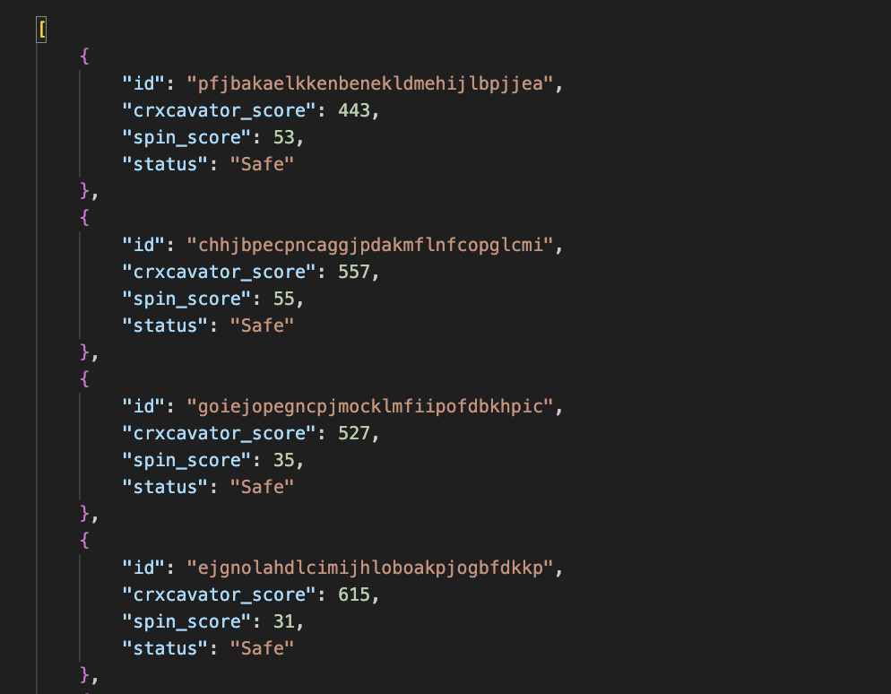

# Chrome Enterprise Policy Management Suite

A robust set of Python tools designed for Chrome Enterprise administrators to **export**, **backup**, **import**, and **clean** Chrome browser policies. This suite fully supports both **Organizational Units (OUs)** and **Google Groups**, handling complex App/Extension policies and intelligent "auto-repair" logic for seamless migrations.

## 🚀 Key Benefits

* **Universal Support:** Manage policies for both **OUs** (hierarchical) and **Groups** (flat).
* **Version Control:** Export policies to JSON to track changes over time using Git.
* **Disaster Recovery:** Restore complex policy configurations to any OU or Group in seconds.
* **Migrate:** Seamlessly promote policies from non-prod to prod environments.
* **Policy Hygiene:** Easily revert local overrides to inherited states with the new **Inheritor** tool.
* **Dual Authentication:** Supports both **Local Admin** (OAuth 2.0 browser flow) and **Service Accounts** (CI/CD automation).

---

## ⚙️ Prerequisites

1.  **Python 3.8+** installed.
2.  **Google Cloud Project** with the **Chrome Policy API** enabled.
3.  **Dependencies:** Install via pip:
    ```bash
    pip install google-api-python-client google-auth-httplib2 google-auth-oauthlib
    ```

---

## 🔧 Configuration

Before running the scripts, open the python files and update the `CUSTOMER_ID` constant:

```python
CUSTOMER_ID = "customers/C0xxxxxxx"  # Replace with your actual Customer ID
```

### Authentication Setup
The scripts support two modes. You can switch modes via the `--use-service-account` flag.

#### Mode A: Local Admin (Default)
Best for running scripts manually on your workstation.
1.  Download your OAuth 2.0 Client credentials from Google Cloud.
2.  Save the file as `client_secrets.json` in the script directory.
3.  The first run will open a browser window to authenticate.

#### Mode B: Service Account (Automation)
Best for scheduled tasks or CI/CD pipelines.
1.  Create a Service Account in Google Cloud.
2.  Grant it the Chrome Policy API roles (e.g., Chrome Policy API Viewer/Editor).
3.  Download the JSON key and save it as `service_account.json`.
4.  Run scripts with the --use-service-account flag.

## 📦 Tool 1: Policy Exporter ([`policy_exporter.py`](https://github.com/google/ChromeBrowserEnterprise/blob/main/Python/policy_exporter.py))
Exports policies from a source OU or Group into a timestamped JSON file.

### Features
- App Deduplication: Solves a common API issue where multiple apps share the same schema name. This tool correctly captures unique policies for every app.
- Raw JSON: Exports the full API payload, preserving metadata like `sourceKey` (where the policy came from) and `addedAt` timestamps.

#### Usage
1. Export from an Organizational UnitExports effective policies (Local + Inherited) by default.
   ```Bash
    python policy_exporter.py orgunits/03ph8a2z12345
    ```

    Optional: Use `--local-only` to skip inherited policies.

2. Export from a Google GroupExports policies applied directly to the group.
    ```Bash
    python policy_exporter.py groups/02gq7lqe2abc
    ```
3. Export using Service Account
    ```Bash
    python policy_exporter.py orgunits/03ph8a2z12345 --use-service-account
    ```
### Output: 
A file named like `orgunits_03ph8a2z_Dec_12_2025_18-30.json` or `groups_02gq7lqe_...json` will be created.

## 📥 Tool 2: Policy Importer ([policy_importer.py](https://github.com/google/ChromeBrowserEnterprise/blob/main/Python/policy_importer.py))
Imports a JSON policy file into a target OU or Group.
### Features
- Strict Type Validation: The tool strictly validates the source and target types.
    - ✅ OU Export $\rightarrow$ OU Target
    - ✅ Group Export $\rightarrow$ Group Target
    - ❌ OU Export $\rightarrow$ Group Target (Blocked to prevent mismatches)
- Smart Fix (Auto-Repair): If you import an app configuration (e.g., Managed Config) but are missing the `InstallType` policy (often lost during "Local Only" exports), this tool detects the error and automatically injects `InstallType: ALLOWED`.
- Namespace Batching: Automatically groups policies by namespace (`chrome.users` vs `chrome.users.apps`) to prevent "Namespace Mismatch" API errors.

### Usage
1. Import to an Organizational Unit
    ```Bash
    python policy_importer.py my_ou_backup.json orgunits/03ph8a2z98765
    ```
2. Import to a Google Group
    ```Bash
    python policy_importer.py my_group_backup.json groups/02gq7lqe2abc
    ```
3. Import using Service Account
    ```Bash
    python policy_importer.py my_backup.json orgunits/03ph8a2z98765 --use-service-account
    ```

## 🧹 Tool 3: Policy Inheritor ([`policy_inheritor.py`](https://github.com/google/ChromeBrowserEnterprise/blob/main/Python/policy_inheritor.py))
A cleanup tool that reverts "Locally Applied" policies on an OU back to their "Inherited" state. This effectively clears local settings.

### Features
- Smart App Reset: Uses wildcard inheritance (`chrome.users.apps.*`) to cleanly remove locally managed apps without causing API dependency errors.
- Safety Checks: Automatically filters out Root-Restricted policies that cannot be inherited
- Scope Protection: Only touches policies explicitly defined on the target OU; inherited settings from parents are left untouched.

#### Usage
1. Clean an Organizational Unit
   ```Bash
    python policy_inheritor.py orgunits/03ph8a2z12345
    ```

    Note: The script will prompt for confirmation before making changes.

### 📝 Logging & Debugging
Both tools include a `DEBUG` toggle at the top of the script:
    ```Python
    DEBUG = False  # Set to True to enable file logging
    ```
- Console Output: Shows real-time progress, validation errors, and "Smart Fix" actions.
- debug_log.txt: If enabled, captures full stack traces, API response details, and input arguments for troubleshooting.

# Chrome Enterprise Extension Inventory Exporter

A Python tool designed for Chrome Enterprise administrators to export a comprehensive, highly-detailed inventory of Chrome extensions installed across their managed browser fleet.

Unlike standard Admin Console reports, this script cross-references multiple Google APIs to map every single extension installation to its specific device, OS, Chrome profile, and signed-in user, alongside rich metadata like requested permissions and risk assessments.

## Features

* **Deep Hierarchy Extraction:** Accurately traverses the `devices -> browsers -> profiles -> extensions` hierarchy using the Admin SDK `v1.1beta1` endpoint.
* **Rich Extension Metadata:** Augments installation data with Web Store details (Permissions, Risk Level, Display Name) using the [Chrome Management API](https://developers.google.com/chrome/management).
* **Flexible Authentication:** Supports both User OAuth 2.0 (for interactive administrative runs) and Service Accounts (for automated/cron jobs).
* **Analyzable Output:** Choose between a grouped JSON output or a **flattened CSV** format perfect for pivot tables and filtering in Excel or Google Sheets.

## ⚙️ Prerequisites

1. **Python 3.8+**
2. **Google Cloud Project** with the following APIs enabled:
   * Admin SDK API
   * Chrome Management API
3. **Required Python Packages:**
   ```bash
   pip install google-api-python-client google-auth-httplib2 google-auth-oauthlib

## Required OAuth Scopes
Your application/credentials will need the following scopes:

- `https://www.googleapis.com/auth/admin.directory.device.chromebrowsers.readonly`
- `https://www.googleapis.com/auth/admin.directory.orgunit.readonly`
- `https://www.googleapis.com/auth/chrome.management.reports.readonly`
- `https://www.googleapis.com/auth/chrome.management.appdetails.readonly`

## 🔧 Setup
1. Clone or download this repository.
2. Open [chrome_extension_inventory_exporter.py](chrome_extension_inventory_exporter.py) in your text editor.
3. Update the CUSTOMER_ID variable with your Google Workspace Customer ID (e.g., customers/C0xxxxxxx).
4. Update the SERVICE_ACCOUNT_FILE and CLIENT_SECRETS_FILE variables to point to your local Google Cloud credential JSON files.

## :factory: Usage
The script requires a target_id (Organizational Unit ID) as a positional argument.

### Basic Run (JSON Output)
Exports the data grouped by Extension ID into a .json file.
```Bash
python chrome_extension_inventory_exporter.py 03ph8a2z1en
```
### CSV Export (Recommended for Analysis)
Exports a flattened tabular format where every row represents a single installation of an extension on a specific machine/profile.

```Bash
python chrome_extension_inventory_exporter.py 03ph8a2z1en --format csv
```

### 📝 Logging & Debugging
- **Missing Extension Data in JSON/CSV**: Ensure you are passing a specific OU ID. Querying the root without iterating through OUs can cause Google's API to truncate extension payloads.

- **403 Forbidden / 401 Unauthorized#**: Delete the `token_extensions.pickle` file to force a re-authentication and re-consent to the requested scopes. Ensure your Admin account has the required privileges.

- **Debug Logging**: Run the script with the `--debug` flag to generate a debug_log.txt containing full Python tracebacks and HTTP errors.

# Move Chrome browsers between Organization Units
You can use the [moveBrowserToOrgUnit](moveBrowserToOrgUnit.py) to move enrolled browser between Organization Units (OU). 

Note: You will need to add the customer ID, the service account key JSON file, and the destination OU path to the script.

👉 Add the customer id [here](https://github.com/google/ChromeBrowserEnterprise/blob/main/Python/moveBrowserToOrgUnit.py#L12). You can find the customer Id by navigating to the Google Admin Console > Account > Account Settings.

👉 Add the path to the OAuth client secret file [here](https://github.com/google/ChromeBrowserEnterprise/blob/main/Python/moveBrowserToOrgUnit.py#L10). You can download the file from the Google Developer Console

👉 Add the [destination OU path](https://github.com/google/ChromeBrowserEnterprise/blob/main/Python/moveBrowserToOrgUnit.py#L14). An example of the destination OU path 'North America/Austin/AUS Managed User'

```
python moveBrowserToOrgUnit.py
```

# Get Chrome Signed-On User account names
You can use the [cbcm-profiles-export.py](cbcm-profiles-export.py) to get a CSV export of Signed-On User account names. 

Note: You will need to add the customer ID, the service account key JSON file, and the destination OU path to the script.

👉 Add the customer id [here](https://github.com/google/ChromeBrowserEnterprise/blob/main/Python/cbcm-profiles-export.py#L24). You can find the customer Id by navigating to the Google Admin Console > Account > Account Settings.

👉 Add the path to the OAuth client secret file [here](https://github.com/google/ChromeBrowserEnterprise/blob/main/Python/cbcm-profiles-export.py#L22). You can download the file from the Google Developer Console

👉 Optional: Add the [destination OU path](https://github.com/google/ChromeBrowserEnterprise/blob/main/Python/cbcm-profiles-export.py#L26). An example of the destination OU path 'North America/Austin/AUS Managed User'

```
python cbcm-profiles-export.py
```

# BlockExtensionBasedOnRiskScore Script

This Python script, `BlockExtensionBasedOnRiskScore.py`, automates the process of identifying and blocking potentially risky Chrome extensions in a Chrome Browser Cloud Management environment. It evaluates extensions based on risk scores obtained from Crxcavator and Spin.ai.

Note: If the risk scores of the newest versions of installed extensions are not available, this script will pick up the scores from the older versions.

### Configuration 

👉 `SERVICE_ACCOUNT_FILE`: Path to your service account key JSON file. 

👉 `CUSTOMER_ID`: Your Google Workspace customer ID. You can find the customer Id by navigating to the Google Admin Console > Account > Account Settings.

👉 `CRX_RISK_THRESHOLD` and `SPIN_RISK_THRESHOLD`: The risk thresholds for Crxcavator and Spin.ai scores.

👉 `ADMIN_USER_EMAIL`: The email address of an admin user in your Google Workspace.

👉 `TARGET_OU`: The OU name where extensions will be blocked.  An example of the destination OU name would be ’AUS Managed User'


```
python BlockExtensionBasedOnRiskScore.py
```



# Get information about Chrome browsers that are managed by your organization using Chrome Enterprise Core
[cbcm-browser-basic-export.py](https://github.com/google/ChromeBrowserEnterprise/blob/main/Python/cbcm-browser-basic-export.py) automates the process of collecting and organizing important details about Chrome browsers managed using Chrome Enterprise Core (CEC), making it easier to keep track of them.

The output include things like:
* Which computer it's on
* The browser's version
* Whether it has any updates waiting
* Number of installed extensions
* Number of configured browser policies
* When it was last used

The code takes all the collected browser information and neatly puts it into a CSV file.
