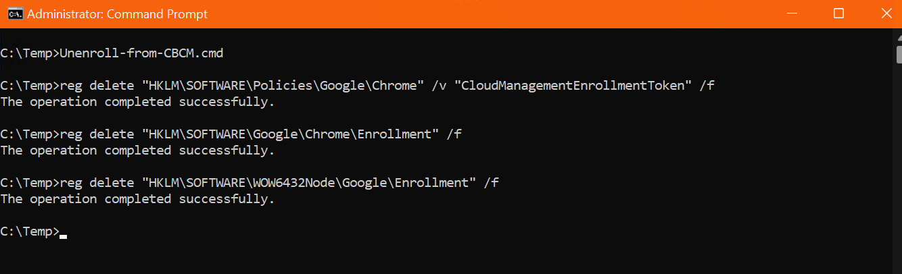

# Random Scripts
## Wake Browser
Consider using the [wake browser script](/Windows/PowerShell/WakeBrowser.ps1) to run Chrome silently under the System context to allow version data to update to the Windows registry. 

```
.\WakeBrowser.ps1
```

## Force Update
You can force an update to the browser and run Chrome silently under the System context to allow version data to update to the Windows registry. 

[update3web_demo](/Windows/PowerShell/update3web_demo.js) from the [Google Omaha team](https://github.com/google/omaha/tree/main/omaha/tools/performondemand) :heart:.

```
cscript update3web_demo.js {8A69D345-D564-463c-AFF1-A69D9E530F96} 1 3
```

update3web_demo.js script takes three arguments:

arg[0] {8A69D345-D564-463c-AFF1-A69D9E530F96} is the Chrome Stable product guid.

arg[1] 1 applies to the Machine.

arg[2] 3 perform an Update.


## Disable Edge default browser settings campaigns
Use the [disableEdgeDefaultBrowserSettingsCampaigns](/Windows/PowerShell/disableEdgeDefaultBrowserSettingsCampaigns.ps1) script to decline the Microsoft Edge default browser and/or default search engine campaigns. With the [DefaultBrowserSettingsCampaignEnabled](https://learn.microsoft.com/en-us/deployedge/microsoft-edge-policies#defaultbrowsersettingscampaignenabled) policy set to disabled, users will not be prompted to set Microsoft Edge as the default browser, or to set Microsoft Bing as the default search engine.

```
.\disableEdgeDefaultBrowserSettingsCampaigns.ps1
```

## Unenroll a browser
You can unenroll a browser from the local endpoint by running the [Unenroll-from-CBCM.cmd](/Windows/PowerShell/Unenroll-from-CBCM.cmd) from an administrator mode shell. 




```
 Unenroll-from-CBCM.cmd
```
